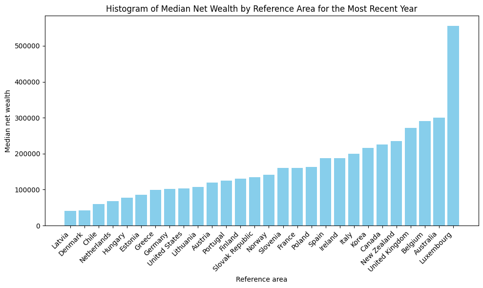
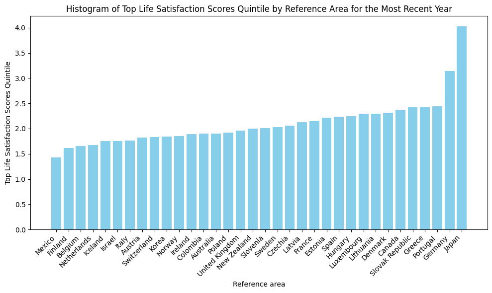

# Project of Data Visualization (COM-480)

| Student's name    | SCIPER |
| ----------------- | ------ |
| Francesco La Rosa | 396622 |
| Nicholas Bunjamin | 396640 |
| Corvin Laube      | 405240 |

[Milestone 1](#milestone-1) • [Milestone 2](#milestone-2) • [Milestone 3](#milestone-3)

## Milestone 1 (21st March, 5pm)

**10% of the final grade**

This is a preliminary milestone to let you set up goals for your final project and assess the feasibility of your ideas.
Please, fill the following sections about your project.

_(max. 2000 characters per section)_

### Dataset

We have selected the OECD How’s Life? database for our project. This database is an initiative by the Organisation for Economic Co-operation and Development (OECD) aimed at measuring well-being beyond GDP by comparing countries across multiple dimensions of quality of life. The dataset specifically focuses on 11 dimensions of current well-being, including Income and Wealth, Housing, Work and Job Quality, Health, Knowledge and Skills, Environmental Quality, Subjective Well-being, Safety, Work-Life Balance, Social Connections, and Civic Engagement. Each dimension is represented by multiple quantitative indicators, enabling comprehensive country profiles and detailed comparisons over a 20-year period (2004–2024).

The data originates from official OECD statistics and reputable national sources, ensuring high reliability and credibility. Approximately 80% of the indicators are regularly published by the OECD, with additional data sourced from internationally recognized institutions such as national statistical offices, United Nations Statistics, and the Gallup World Poll.

The How’s Life? database covers all 38 OECD member countries, which predominantly include developed economies. While comprehensive within this scope, the dataset notably excludes most developing countries, given its OECD-centered focus. Nevertheless, the countries represented provide robust insights into diverse economic, social, and governance contexts for comparative analyses of well-being.

The dataset is rigorously maintained by OECD experts, ensuring completeness, accuracy, and consistency. It is openly accessible through OECD’s dedicated data portals and is exportable in widely used formats such as CSV and JSON. Due to its careful curation, the dataset requires minimal preprocessing or data cleaning, making it particularly suitable for robust research and analytical purposes.

Dataset available at: [How’s Life? database](https://data-explorer.oecd.org/vis?fs[0]=Topic%2C1%7CSociety%23SOC%23%7CWell-being%20and%20beyond%20GDP%23SOC_WEL%23&pg=0&fc=Topic&bp=true&snb=26&df[ds]=dsDisseminateFinalDMZ&df[id]=DSD_HSL%40DF_HSL_CWB&df[ag]=OECD.WISE.WDP&df[vs]=1.1&dq=.11_2%2B11_1%2B9_3%2B9_2%2B8_2%2B8_1_DEP%2B7_2%2B7_1_DEP%2B6_2_DEP%2B6_2%2B5_3%2B5_1%2B4_3%2B4_1%2B3_2%2B3_1%2B2_7%2B2_2%2B2_1%2B1_3%2B1_2%2B1_1.._T._T._T.&lom=LASTNOBSERVATIONS&lo=1&pd=%2C&to[TIME_PERIOD]=false)

### Problematic

> Frame the general topic of your visualization and the main axis that you want to develop.
>
> - What am I trying to show with my visualization?
> - Think of an overview for the project, your motivation, and the target audience.

### Exploratory Data Analysis

The dataset consists of 11 main categories: Wealth, Employment, Housing, Free Time, Health, Education, Social Environment, Political Say, Natural Environment, Crime and General Satisfaction. All those categories are further divided into subcategories.

The data is collected from 38 countries including many European countries, North America, Oceania, some countries of Central America and few of Asia. There is no data of African countries. All the data was collected between 2004 and 2024.

To start with a classic example we have the median net wealth by country. As not all counties have measured this in the same year, we have take the most recent year of each country which are all close to each other.

// Number of data points 89713.

As expected Luxemburg is on the first place by far. Interestingly, Denmark and Latvia are on the last places even behind Chile.

If we compare this to the mean score of the highest quintile of life satisfaction we can see that for the 3 countries meantioned before median net wealth does not correlate with top quintile life satisfaction.

### Related work

> - What others have already done with the data?
> - Why is your approach original?
> - What source of inspiration do you take? Visualizations that you found on other websites or magazines (might be unrelated to your data).
> - In case you are using a dataset that you have already explored in another context (ML or ADA course, semester project...), you are required to share the report of that work to outline the differences with the submission for this class.

OECD themselves have made multiple different visualizations for their own data, such as an interactive dashboard allowing users to weight 11 well-being dimensions, a mapping of BLI indicators geographically, and many different charts. esearchers have leveraged OECD BLI data to analyze well-being through composite indicators, regression models, and multivariate techniques, often linking metrics to economic equity or development . Some have reimagined aggregation methods such as hierarchical weighting to align with public priorities

We plan on using OECD's own visualizations as a source of inspiration for our project. In particular, the interactive dashboard allows users to generate their own personalized rankings of country performance. We believe that this style of user-driven storytelling will be good to capture user's attention. In addition, their use of flowers to visualize the 11 well-being dimensions allows them to simplify the multivariate data without losing nuance. The geographic mapping of BLI indicators also offers a spatial lens to compare outcomes. These qualities are things we wish to emulate in our project. By blending modular interactivity and intuitive visual metaphors, we aim to empower users to explore well-being trends through their own priorities, in order to balance clarity with depth. None of us have used this dataset before in any previous works or personal projects.

## Milestone 2 (18th April, 5pm)

**10% of the final grade**

## Milestone 3 (30th May, 5pm)

**80% of the final grade**

## Late policy

- < 24h: 80% of the grade for the milestone
- < 48h: 70% of the grade for the milestone
